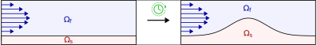

# Temporal Multirate Finite Element Method

In this repository, we provide the code used for the numerical experiments in the paper "A monolithic space-time temporal multirate finite element framework for interface and volume coupled problems" by J. Roth, M. Soszyńska, T. Richter and T. Wick.
Additionally, we provide another code for the staggered temporal multirate finite element method for poroelasticity at the example of the Mandel problem.

For technical details, we refer to [the journal article](https://doi.org/10.1016/j.cam.2024.115831) and [the arXiv preprint](https://doi.org/10.48550/arXiv.2307.12455).
To cite this code, please use the following BibTeX citation:

```
@article{RoSoRiWi2024,
  title = {A monolithic space–time temporal multirate finite element framework for interface and volume coupled problems},
  journal = {Journal of Computational and Applied Mathematics},
  volume = {446},
  pages = {115831},
  year = {2024},
  issn = {0377-0427},
  doi = {https://doi.org/10.1016/j.cam.2024.115831},
  url = {https://www.sciencedirect.com/science/article/pii/S0377042724000803},
  author = {Julian Roth and Martyna Soszyńska and Thomas Richter and Thomas Wick},
  keywords = {Galerkin space–time, Multirate, Monolithic framework, Interface coupling, Volume coupling, Mandel’s benchmark}
}
```

## Motivation

We are often dealing with multiphysics problems that have dynamics on different time scales.
An example of this is [atherosclerosis](https://www.hopkinsmedicine.org/health/conditions-and-diseases/atherosclerosis), where plaque deposits on the walls of a human's arteries and then reduces blood flow, possibly even causing heart attacks or strokes.
Simulating this medical phenomenon is complex because we have to accurately model:
- the plaque growth,
- the blodd flow.

<p align="center">
  
</p>
</p>  
This is challenging because the plaque deposition takes place on a scale of weeks, months or even years, while the heart pumps blood through the arteries roughly 1-2 times per second.
Consequently, we could either simulate both physical phenomena on a scale of seconds (or fractions of a second), we could try to average everything in time (homogeneization) or we could separately solve both physics on their respective time scales (staggered scheme). <br><br>

<u>BUT:</u> Can we also solve both physics at once, while using the respective time scale for each problem? This would be faster than solving everything on the smaller time scale and is more accurate and numerically robsut than using homogenization or using a staggered scheme.

<u>ANSWER:</u> Yes, we can by using restriction matrices (from geometric multigrid) and from one side restrict the temporal matrices that have been assembled on the finer temporal mesh. 
For more details, please take a closer look at the paper.

## Running the code

### Example 1: Coupled heat and wave equation in 1+1D
The code for this example is located in `src/monolithic_heatwave` and is based on the FEM library `deal.II 9.3.3`. <br>
1. Go to `main.cc` and make sure that `#  define DIM 1`. <br>
2. To compile the code run `cmake .; make release; make; mv main main_1d`. <br>
3. To run the convergence tests from the paper execute `sh run_1d_for_paper.sh` and to analyze the results go to `paper_output_1d` and run `python3 create_convergence_plots.py`.

### Example 2: Coupled heat and wave equation in 2+1D with fluid source term
The code for this example is located in `src/monolithic_heatwave` and is based on the FEM library `deal.II 9.3.3`. <br>
1. Go to `main.cc` and make sure that `#  define DIM 2` and `#  define SOLID_SOURCE false`. <br>
2. To compile the code run `cmake .; make release; make; mv main main_2d`. <br>
3. To run the convergence tests from the paper execute `sh run_2d_for_paper.sh` and to analyze the results go to `paper_output_2d` and run `python3 create_convergence_plots.py`.

### Example 3: Coupled heat and wave equation in 2+1D with solid source term
The code for this example is located in `src/monolithic_heatwave` and is based on the FEM library `deal.II 9.3.3`. <br>
1. Go to `main.cc` and make sure that `#  define DIM 2` and `#  define SOLID_SOURCE true`. <br>
2. To compile the code run `cmake .; make release; make; mv main main_2d_solid`. <br>
3. To run the convergence tests from the paper execute `sh run_2d_solid_for_paper.sh` and to analyze the results go to `paper_output_2d_solid` and run `python3 create_convergence_plots.py`.

### Example 4: Poroelasticity in 2+1D: Mandel problem

### Example 5: Poroelasticity in 3+1D: Footing problem

